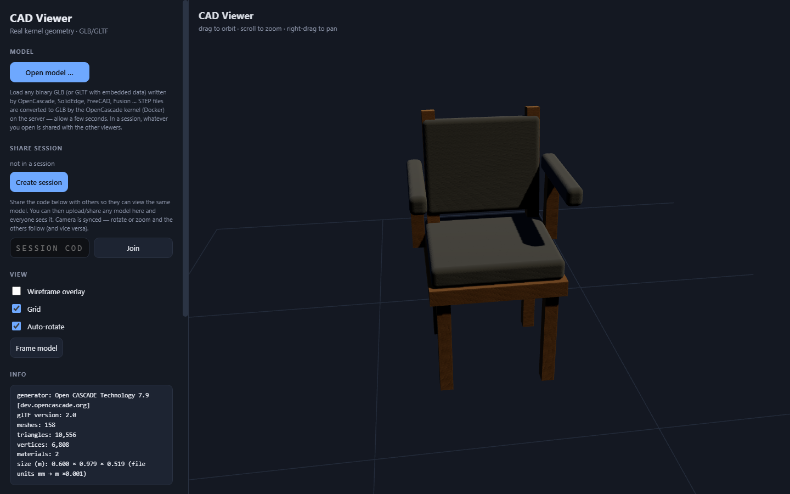
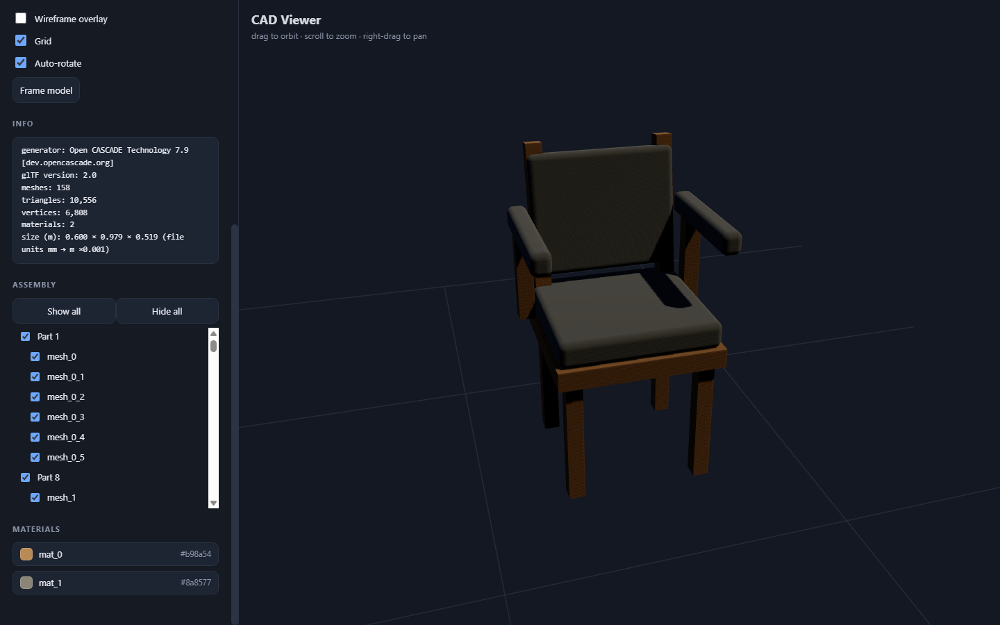
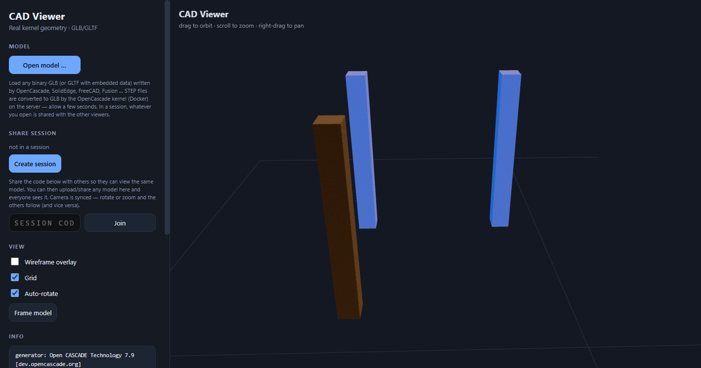
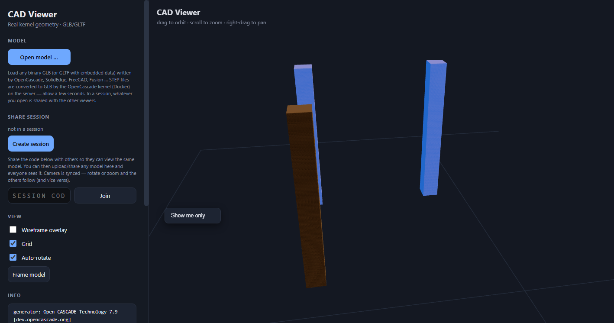
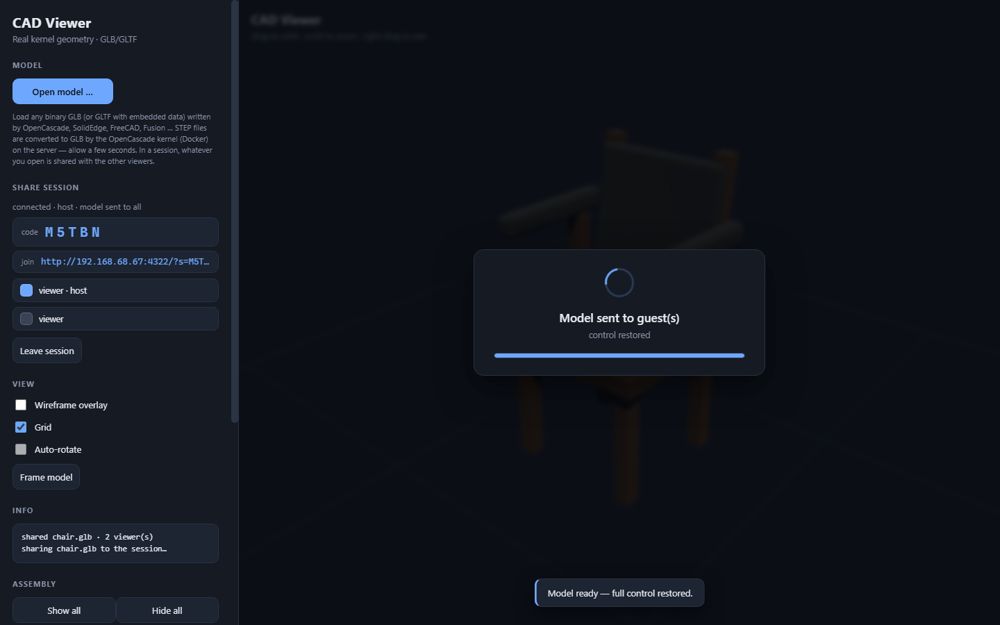
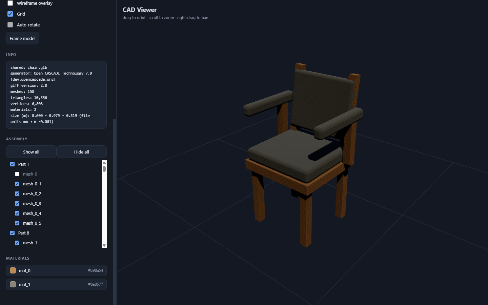

# CAD Viewer — User Manual

**Version:** v0.33 · **URL:** http://localhost:8088/

CAD Viewer is a real-time collaborative browser app for viewing CAD geometry
(GLBs from SolidEdge, FreeCAD, Fusion 360, OpenCascade…, plus STEP, IGES and
OBJ files converted on the server). Create a session, share a model, and
everyone on your LAN follows your camera and part visibility live — or just
use it as a plain local viewer.

---

## 1. Starting the app

**Portable zip (Windows, no installs):**

1. Unzip `cad-viewer-portable.zip` anywhere.
2. Double-click **`start.bat`**. It launches the server and opens the browser.
3. The app is served at **http://localhost:8088/**

**From source:** `npm start` (or `node src/server.js`) in the project folder, then open the same URL.

### Changing the port

The default port is **8088**. Any of these overrides it:

| Method | Example |
|---|---|
| Launcher argument (zip) | `start.bat 5555` |
| `port.txt` file next to the launcher (`start.bat` / `start.sh`) | create `port.txt` containing `5555` |
| Environment variable | `set PORT=5555` then `npm start` (Windows) / `PORT=5555 npm start` (macOS/Linux) |

Precedence: command-line argument → `port.txt` → env `PORT` → default 8088.
The join link and `/ip` address always reflect the actual port, so guests don't
need to know it.

> **STEP, IGES and OBJ files** (.step/.stp, .igs/.iges, .obj) additionally need
> Docker + the `chair-cq:local` OpenCascade image. Run
> **`install-docker-opencascade.bat`** once to set that up. GLB/GLTF files work
> without any of it.

---

## 2. Opening a model

1. Click **Open model…** in the left sidebar.
2. Choose a `.glb`, `.gltf`, `.step`, `.stp`, `.igs`, `.iges` or `.obj` file from your computer.

GLB/GLTF loads instantly. STEP, IGES and OBJ files are converted to GLB by the
OpenCascade kernel on the server (a blocking overlay shows progress — a few
seconds).

The sidebar shows you:

- **Info** — generator, mesh/triangle counts, dimensions and units
- **Assembly** — the part tree (see §3)
- **Materials** — swatches of every colour in the model

---

## 3. The Assembly panel — parts and visibility

Every part of the model appears in the **Assembly** tree. The tree opens
expanded to **level 2** (the top assembly plus its direct children); deeper
levels are collapsed until you expand them.

### Expand / collapse

- Rows that contain sub-parts show a **+/− toggle** on the left.
- Click **+** to expand (show children), **–** to collapse (hide them).
- Expanding/collapsing is purely visual — it never changes part visibility.

### Show / hide parts

- **Checkbox** per part: uncheck to hide it in the viewport, check to show.
- Toggling a parent cascades to its whole subtree — turning a sub-assembly on
  brings all its children back with it (three.js needs the whole chain visible
  to render anything).
- **Show all / Hide all** buttons apply to the whole model at once.

### Highlight a part (click the name)

Click a part's **name** to highlight it in blue in the viewport. Click another
part to move the highlight; click the same part again to clear it. The highlight
uses per-mesh material copies, so other parts sharing the same source material
are unaffected.

### "Show me only" (right-click)

Right-click a part and choose **Show me only** to hide everything except that
part and its children. Ancestors stay visible so the isolated part still renders.

**In a session (see §5), all of this syncs to every member** — show/hide,
expand/collapse, and the selection highlight are mirrored live in both
directions.

---

## 4. Navigating the viewport

| Action | Effect |
|---|---|
| **Drag** (left button) | Orbit the camera |
| **Scroll** | Zoom |
| **Right-drag** | Pan |
| **Frame model** button | Reset the view to fit the model |
| **Wireframe overlay** | Toggle wireframe on all parts |
| **Grid** | Toggle the ground grid |
| **Auto-rotate** | Slow turntable spin (disabled in a session) |

---

## 5. Lighting & animation

### Lighting

A **Lighting** section in the sidebar lets you tune the light on the model:

| Control | What it does | Range | Default |
|---|---|---|---|
| **Ambient** | Even fill from the sky and ground | 0–2 | 0.9 |
| **Key** | Main directional light (casts shadows) | 0–6 | 2.4 |
| **Fill** | Cool fill light from the opposite side | 0–3 | 0.6 |
| **Front** | Light straight from the viewer's side — handy when the front face is too dark | 0–3 | 0 (off) |

Drag a slider and the model updates live. **Reset lighting** restores the defaults.

### Animation

If the GLB you load contains **keyframe animation** (e.g. from Blender or a game pipeline — CAD-converted STEP/IGES/OBJ files have none), an **Animation** section appears with:

| Control | What it does |
|---|---|
| **Play / Pause** | Start or stop the clip |
| **Loop** | Repeat the clip (off = play once and stop) |
| **Speed** | Playback speed 0.25×–4× |
| **Clip** | Pick a clip when the model has several |

### Session sync

In a session, the **lighting levels (Ambient/Key/Fill/Front)** and the **animation state (clip, play/pause, loop, speed)** are shared with the other viewers, and late joiners receive the current settings. Camera, part visibility, tree expand/collapse and selection sync as well (see §6).

---

## 6. Collaborative sessions (host)

Sessions let other people on your LAN view the same model and follow your
camera and part visibility.

1. Click **Create session** — a 5-character code appears.
2. **Open a model** (or re-share one you've already loaded).
3. Share the **join link** shown under the code, or the code itself, with the
   other users.

While the model is being handed to guests you'll see a blocking
**“Sending model to guest(s)…”** overlay; control is restored automatically once
every connected guest confirms receipt.

The roster under the code shows who is connected.

---

## 7. Joining a session (guest)

On another computer (same network):

1. Open the **join link** the host sent you, **or**
2. Open the app, type the code into **session code** and click **Join**.

You'll see a **“Receiving model…”** overlay with byte progress, then the model
appears — same view, same parts, same visibility as the host.

### What stays in sync

- **Camera** — whoever orbits/zooms/pans, everyone follows (both directions)
- **Part visibility** — show/hide any part and it changes for all members
- **The model itself** — late joiners automatically receive the current model
  and visibility state
- **Expand/collapse & selection** — the assembly-tree view and part highlight
  are mirrored live across members

---

## 8. Leaving a session

Click **Leave session** — you keep your local model and return to solo viewing.
The session itself stays alive on the server for other members.

---

## 9. Opening a STEP / IGES / OBJ file

STEP, IGES and OBJ conversion happens through the OpenCascade kernel (Docker).
The first time you open one you'll see the conversion overlay; when it finishes
the GLB is loaded — with the original **colours and materials** preserved, and
part names appearing in the Assembly tree.

> **OBJ colours need the `.mtl` file too.** A Wavefront `.obj` stores colours in
> a sibling `.mtl` (e.g. `Asm1.obj` + `asm1.mtl`). Select **both** files in the
> Open dialog (Ctrl+click on Windows) so the materials are applied; opening
> just the `.obj` still works, but parts get a neutral grey.

> **OBJ part names.** Unlike STEP/IGES (which embed B-rep solid names), OBJ has
> no mandatory part number. Part names come from the file's `o` (object) / `g`
> (group) lines when the CAD tool writes them — e.g. SolidEdge's `Asm1.obj`
> has none, so parts are named `Part1`, `Part2`. If an exporter writes `o Part2`
> / `o Part3`, those names are used directly.

If Docker or the `chair-cq:local` image isn't installed, these formats show a
conversion error while GLB/GLTF continues to work normally.

---

## 10. Troubleshooting

| Problem | Fix |
|---|---|
| Can't open the app on another PC | Use the **join link** (LAN address), make sure both PCs are on the same network, and that port 8088 isn't blocked by a firewall |
| STEP/IGES/OBJ shows “conversion failed” | Run `install-docker-opencascade.bat`; confirm Docker is running with the `chair-cq:local` image |
| OBJ parts are grey (no colours) | The `.obj` was opened without its `.mtl` — select both files together in the Open dialog |
| Guest doesn't get the model | The host must be connected with a model loaded — joining an empty session shows nothing until the host shares |
| Port already in use | Change it: `start.bat 4323` (zip), a `port.txt` file, or `set PORT=4323` |
| Join link shows the wrong IP | The link uses the host's LAN address; refresh/re-create the session to re-detect it |

---

*CAD Viewer v0.22 — collaborative CAD viewing for the LAN.*
