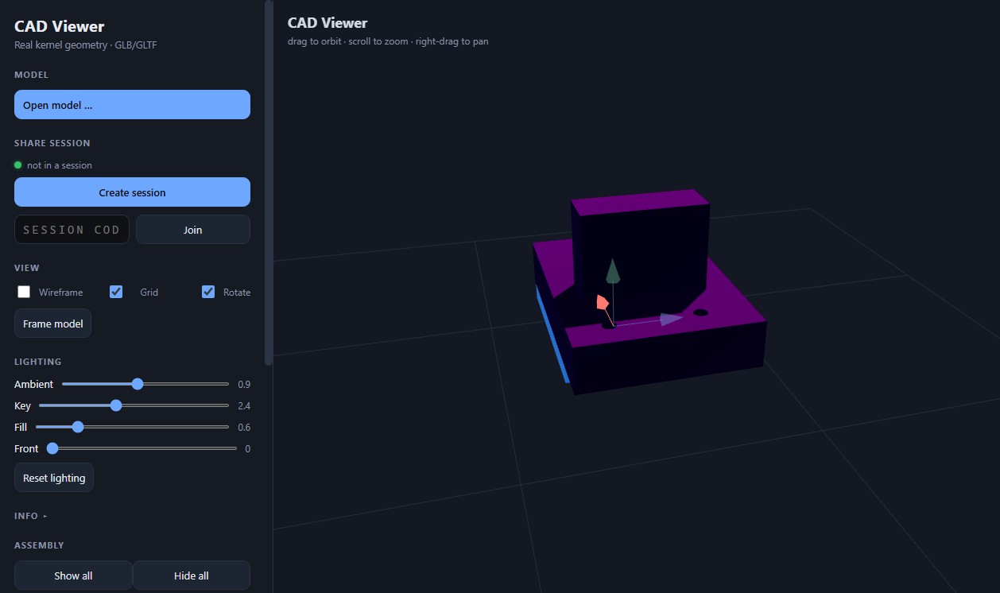

# CAD Viewer — User Manual

**Version:** v0.55 · **URL:** http://localhost:8088/

## Table of Contents

1. [Welcome — why CAD Viewer?](#1-welcome--why-cad-viewer)
2. [Starting the app](#2-starting-the-app)
3. [Opening a model](#3-opening-a-model)
4. [The Assembly panel](#4-the-assembly-panel--parts-and-visibility)
5. [Navigating the viewport](#5-navigating-the-viewport)
6. [Lighting & animation](#6-lighting--animation)
7. [Collaborative sessions (host)](#7-collaborative-sessions-host)
8. [Joining a session (guest)](#8-joining-a-session-guest)
9. [Leaving a session](#9-leaving-a-session)
10. [Opening a STEP / IGES / OBJ file](#10-opening-a-step--iges--obj-file)
11. [Standalone CAD converter (convert-cad)](#11-standalone-cad-converter-convert-cad)
12. [Troubleshooting](#12-troubleshooting)
13. [Sharing with external parties](#13-sharing-with-external-parties)

---

## 1. Welcome — why CAD Viewer?

::: hero

:::

::: callout
**Turn a CAD file into a live, shared 3D scene.** CAD Viewer is a real-time
collaborative browser app for viewing CAD geometry. Anyone on your network can
open the model with nothing more than a web browser — no CAD software, no
licences, no installs. Everyone shares the same view, and everyone can interact
with it.
:::

### At a glance

Instead of emailing files back and forth, share a live model:

| Instead of… | CAD Viewer lets you… |
|---|---|
| Export → email → wait → open → repeat | Share one **join link**; the model appears instantly |
| Sending multi-MB CAD bundles | Convert to lightweight **GLB/GLTF** once and share a small file |
| Explaining with static screenshots | **Point, move and zoom together** on the live model |
| Guests installing CAD software | Guests open the link in **any browser — nothing to install** |
| Worrying about files leaving your PC | The model is **streamed to memory only**; nothing is written to the guest's disk |

### Application features

::: features
**Both host and guest can interact.** This is not a one-way broadcast — anyone
in a session can orbit, zoom and pan, show or hide parts, highlight a part, and
even move parts along X/Y/Z, mirrored live in both directions.

**Live sync.** Camera, part visibility, selection, and lighting/animation are
shared between all members in real time. Late joiners automatically receive the
current model and view state.

**No install for guests.** A guest needs only a browser — open a link and the
shared model appears. Nothing to download, nothing to set up, no CAD licence.

**Nothing is stored on the guest.** The model is streamed to the guest's memory
(RAM) only and rendered in the browser; no file is written to their disk. Close
the tab and it's gone — ideal for sensitive geometry or NDA work.

**Efficient sharing.** STEP, IGES and OBJ files are converted to **GLB/GLTF** —
a lightweight, web-native format — on the server, so one compact file moves fast
across the network instead of a bulky CAD bundle.

**Cross-platform & faithful.** Works in any modern browser on Windows, macOS,
Linux and tablets; part names, colours and materials survive the conversion, so
reviewers see the design the way it was authored.
:::

### What it helps with

::: callout
**Online calibration of engineering design.** Because everyone shares the same
live view and can interact with it, the design-review / calibration loop
collapses from email-and-export cycles into one shared session — questions are
answered immediately, on the actual geometry, by pointing and looking together.
:::

### Use cases

::: features
**Design review / sign-off** — review the model together across offices or the
shop floor instead of exchanging exports.

**Remote inspection** — check a part or assembly before manufacturing, from
anywhere on the network.

**Live design changes** — everyone watches the part move as it happens.

**Client demo** — show the design without installing CAD on the client's
machine.

**Vendors & subcontractors** — share the live model with a supplier to align on
geometry, fit and tolerances before fabrication.

**Cross-site calibration** — compare a real part against the shared model live,
from a different location.
:::

---

## 2. Starting the app

**Portable zip (Windows, no installs):**

1. Unzip `cad-viewer-portable.zip` anywhere.
2. Double-click **`start.bat`**. It launches the server and opens the browser.
3. The app is served at **http://localhost:8088/**

**From source:** `npm start` (or `node src/server.js`) in the project folder, then open the same URL.

### Changing the port

The default port is **8088**. Any of these overrides it:

| Method | Example |
|---|---|
| Launcher argument (zip) | `start.bat 5555` |
| `port.txt` file next to the launcher (`start.bat` / `start.sh`) | create `port.txt` containing `5555` |
| Environment variable | `set PORT=5555` then `npm start` (Windows) / `PORT=5555 npm start` (macOS/Linux) |

Precedence: command-line argument → `port.txt` → env `PORT` → default 8088.
The join link and `/ip` address always reflect the actual port, so guests don't
need to know it.

> **STEP, IGES and OBJ files** (.step/.stp, .igs/.iges, .obj) additionally need
> Docker + the `chair-cq:local` OpenCascade image. GLB/GLTF files work without
> any of it.

### Installing the STEP converter (Docker + OpenCascade)

To open **STEP / IGES / OBJ** files, the server needs a small converter built on
the OpenCascade CAD kernel, which runs inside a **Docker** container. This is a
**one-time** setup on the PC that runs the server — guests never need it.

Run **`install-docker-opencascade.bat`** (double-click it; it sits in the same
folder as `start.bat`). It walks through everything:

| Step | What the script does |
|---|---|
| **1. Docker check** | If Docker Desktop isn't installed, it installs it automatically via `winget` (~500 MB download) and starts it. You can also install it yourself from https://www.docker.com/products/docker-desktop/ and re-run. |
| **2. Wait for engine** | Waits until the Docker engine is running (first start can take a few minutes). |
| **3. Build the image** | Builds the **`chair-cq:local`** OpenCascade image from the bundled `Dockerfile` — first build downloads ~1 GB and can take **5–15 minutes**. |
| **4. Verify** | Runs a quick check that the OpenCascade kernel is ready, so you know STEP conversion will work. |

**To install it manually** (instead of the script):

1. Install **Docker Desktop** and make sure the engine is running.
2. Open a terminal in the distribution folder and build the image:
   ```
   docker build -t chair-cq:local .
   ```

That's it. Once the image exists, STEP / IGES / OBJ files convert normally. If
you only ever open **GLB / GLTF** files, you can skip this entirely.


---

## 3. Opening a model

1. Click **Open model…** in the left sidebar.
2. Choose a `.glb`, `.gltf`, `.step`, `.stp`, `.igs`, `.iges` or `.obj` file from your computer.

GLB/GLTF loads instantly. STEP, IGES and OBJ files are converted to GLB by the
OpenCascade kernel on the server (a blocking overlay shows progress — a few
seconds).


The sidebar shows you:

- **Info** — generator, mesh/triangle counts, dimensions and units
- **Assembly** — the part tree (see §4)
- **Materials** — swatches of every colour in the model

---

## 4. The Assembly panel — parts and visibility

Every part of the model appears in the **Assembly** tree. The tree opens
expanded to **level 2** (the top assembly plus its direct children); deeper
levels are collapsed until you expand them.


### Expand / collapse

- Rows that contain sub-parts show a **+/− toggle** on the left.
- Click **+** to expand (show children), **–** to collapse (hide them).
- Expanding/collapsing is purely visual — it never changes part visibility.

### Show / hide parts

- **Checkbox** per part: uncheck to hide it in the viewport, check to show.
- Toggling a parent cascades to its whole subtree — turning a sub-assembly on
  brings all its children back with it (three.js needs the whole chain visible
  to render anything).
- **Show all / Hide all** buttons apply to the whole model at once.

### Highlight a part (click the name, or click it in the viewport)

Click a part's **name** to highlight it in blue in the viewport — or **click the
part directly in the 3D viewport** to select it the same way (left-click on the
part; left-click empty space to clear). Click another part to move the
highlight; click the same part again to clear it. The highlight uses per-mesh
material copies, so other parts sharing the same source material are unaffected.


Clicking a part directly in the 3D viewport highlights it the same way:


### "Show me only" (right-click)

Right-click a part — either its name in the tree, or the part directly in the
viewport — and choose **Show me only** to hide everything except that part and
its children. Ancestors stay visible so the isolated part still renders.


### Move a part (X / Y / Z + drag)

With a part highlighted, tick **Move part**, press **X**, **Y** or **Z** to choose
an axis, then **left-drag** in the viewport to slide that part along the axis.
The highlighted **part moves by itself** — its siblings stay put. An X/Y/Z axis
gizmo (red/green/blue) appears at the part so you can see the move directions;
the chosen axis glows brighter. The gizmo stays about **1/8 of the screen** at
any zoom level — zoom in and it shrinks to keep that size. **Undo** steps back
through your last part movements (up to 200), and **Reset** returns all parts to
their original positions and clears the move history. Moves are shared with the
other viewers in the session.



**In a session (see §7), all of this syncs to every member** — show/hide,
expand/collapse, the selection highlight, and part moves are mirrored live in
both directions.

---

## 5. Navigating the viewport

| Action | Effect |
|---|---|
| **Drag** (left button) | Orbit the camera |
| **Scroll** | Zoom |
| **Right-drag** | Pan |
| **Frame model** button | Reset the view to fit the model |
| **Wireframe overlay** | Toggle wireframe on all parts |
| **Grid** | Toggle the ground grid |
| **Auto-rotate** | Slow turntable spin (disabled in a session) |

---

## 6. Lighting & animation

### Lighting

A **Lighting** section in the sidebar lets you tune the light on the model:

| Control | What it does | Range | Default |
|---|---|---|---|
| **Ambient** | Even fill from the sky and ground | 0–2 | 0.9 |
| **Key** | Main directional light (casts shadows) | 0–6 | 2.4 |
| **Fill** | Cool fill light from the opposite side | 0–3 | 0.6 |
| **Front** | Light straight from the viewer's side — handy when the front face is too dark | 0–3 | 0 (off) |

Drag a slider and the model updates live. **Reset lighting** restores the defaults.

### Animation

If the GLB you load contains **keyframe animation** (e.g. from Blender or a game pipeline — CAD-converted STEP/IGES/OBJ files have none), an **Animation** section appears with:

| Control | What it does |
|---|---|
| **Play / Pause** | Start or stop the clip |
| **Loop** | Repeat the clip (off = play once and stop) |
| **Speed** | Playback speed 0.25×–4× |
| **Clip** | Pick a clip when the model has several |

### Session sync

In a session, the **lighting levels (Ambient/Key/Fill/Front)** and the **animation state (clip, play/pause, loop, speed)** are shared with the other viewers, and late joiners receive the current settings. Camera, part visibility, tree expand/collapse and selection sync as well (see §8).

---

## 7. Collaborative sessions (host)

Sessions let other people on your LAN view the same model and follow your
camera and part visibility.

> On launch you're asked to **enter your name**; it is shown to the other
> viewers in the roster (e.g. `Alice · host`, `Bob (you)`). Your name is
> remembered for next time.

1. Click **Create session** — a 5-character code appears.
2. **Open a model** (or re-share one you've already loaded).
3. Share the **join link** shown under the code, or the code itself, with the
   other users.


While the model is being handed to guests you'll see a blocking
**“Sending model to guest(s)…”** overlay; control is restored automatically once
every connected guest confirms receipt.


The roster under the code shows who is connected. The **host** can remove a
viewer by clicking **kick** next to their name; the removed viewer's screen is
cleared and they see *"removed by host"*. A small status dot next to "Share
session" shows whether the server is reachable (green = up, red = down).


---

## 8. Joining a session (guest)

On another computer (same network):

1. Open the **join link** the host sent you, **or**
2. Open the app, type the code into **session code** and click **Join**.

You'll see a **“Receiving model…”** overlay with byte progress, then the model
appears — same view, same parts, same visibility as the host.


### What stays in sync

- **Camera** — whoever orbits/zooms/pans, everyone follows (both directions)
- **Part visibility** — show/hide any part and it changes for all members
- **Part moves** — moving a part updates it for everyone
- **The model itself** — late joiners automatically receive the current model
  and visibility state
- **Expand/collapse & selection** — the assembly-tree view and part highlight
  are mirrored live across members


> **Security — nothing is stored on the guest.** The model is **streamed to the
> guest's memory only** and rendered in the browser. **No file is written to
> the guest's disk**; closing the tab discards it.

---

## 9. Leaving a session

Click **Leave session** to leave. What happens depends on your role:

- **Host** — you keep your local model and return to solo viewing.
- **Guest** — the shared model is **cleared from your view** when you leave on
  your own (for security, nothing stays on your screen), and you return to the
  empty viewer.

The session itself stays alive on the server for the remaining members.


---

## 10. Opening a STEP / IGES / OBJ file

STEP, IGES and OBJ conversion happens through the OpenCascade kernel (Docker).
The first time you open one you'll see the conversion overlay; when it finishes
the GLB is loaded — with the original **colours and materials** preserved, and
part names appearing in the Assembly tree.

> **OBJ colours need the `.mtl` file too.** A Wavefront `.obj` stores colours in
> a sibling `.mtl` (e.g. `Asm1.obj` + `asm1.mtl`). Select **both** files in the
> Open dialog (Ctrl+click on Windows) so the materials are applied; opening
> just the `.obj` still works, but parts get a neutral grey.

> **OBJ part names.** Unlike STEP/IGES (which embed B-rep solid names), OBJ has
> no mandatory part number. Part names come from the file's `o` (object) / `g`
> (group) lines when the CAD tool writes them — e.g. SolidEdge's `Asm1.obj`
> has none, so parts are named `Part1`, `Part2`. If an exporter writes `o Part2`
> / `o Part3`, those names are used directly.


If Docker or the `chair-cq:local` image isn't installed, these formats show a
conversion error while GLB/GLTF continues to work normally.

---

## 11. Standalone CAD converter (convert-cad)

Besides the viewer, the distribution includes a **separate, standalone CAD
converter** — **`convert-cad`** (v0.1) — that turns STEP / IGES / OBJ files into
GLB / GLTF **without** the viewer. It is independent of the viewer's own
converters, so using it can never disturb them.

### What it converts

| Input | Notes |
|---|---|
| `.step`, `.stp` | B-rep; keeps assembly part names + per-part colours |
| `.igs`, `.iges` | B-rep; keeps colours; parts named `Part1..N` |
| `.obj` | Mesh; part names from `o`/`g` lines; colours from a sibling `.mtl` |

Output format is chosen by the **output file extension**: `.glb` → a single
binary file; `.gltf` → text JSON + a companion `.bin`.

### Using the drag-&-drop web UI (recommended)

1. Launch the web UI: double-click **`convert-cad-web.bat`** (Windows), or run
   `node convert-cad-server.mjs` from the `tools/convert-cad/` folder.
2. Open **http://localhost:8787/** in a browser.
3. **Drag & drop** a CAD file onto the page (drop an OBJ together with its
   `.mtl` in one drag for colours).
4. Pick **.glb** or **.gltf**, click **Convert**.
5. **Preview** the result in the built-in 3D viewer (drag = rotate, scroll =
   zoom, right-drag = pan), then **Download**.


### Using the command line

```bash
node convert-cad.mjs input.step output.glb      # or .gltf
```

### Requirements

The converter runs the OpenCascade kernel inside the **`chair-cq:local`**
Docker image — the same one the viewer uses. Docker Desktop must be running and
the image built (`install-docker-opencascade.bat`, or `docker build -t
chair-cq:local .`). **Node.js** is needed for the launcher.

### How it helps sharing

Convert a CAD file to GLB/GLTF once, then hand the lightweight file to someone
who opens it directly in the viewer — they never need Docker or the converter.
It's the same "one compact file over the network" idea, applied offline.

---

## 12. Troubleshooting

| Problem | Fix |
|---|---|
| Can't open the app on another PC | Use the **join link** (LAN address), make sure both PCs are on the same network, and that port 8088 isn't blocked by a firewall |
| STEP/IGES/OBJ shows “conversion failed” | Run `install-docker-opencascade.bat`; confirm Docker is running with the `chair-cq:local` image |
| OBJ parts are grey (no colours) | The `.obj` was opened without its `.mtl` — select both files together in the Open dialog |
| Guest doesn't get the model | The host must be connected with a model loaded — joining an empty session shows nothing until the host shares |
| Port already in use | Change it: `start.bat 4323` (zip), a `port.txt` file, or `set PORT=4323` |
| Join link shows the wrong IP | The link uses the host's LAN address; refresh/re-create the session to re-detect it |

---

## 13. Sharing with external parties

By default the viewer is meant for the **local network (LAN)**. To let someone
outside your network view a session, you have two main options.

### Option 1 — Port forwarding on the router

1. Find the server PC's **LAN IP** (e.g. `192.168.x.x`).
2. In your router's admin page, set up a **port forward**: forward the app's
   port (default **8088**) to that LAN IP and port.
3. Share **`http://<your-public-IP>:8088`** with the external party.

> **Notes.** The public IP can change (use a dynamic-DNS service if needed).
> Opening a port exposes the server to the internet — use this only for trusted
> people, keep it temporary, and close the forward when you're done. For real
> deployments, prefer HTTPS (e.g. a reverse proxy like Caddy/Nginx with TLS).

### Option 2 — Deploy on a public / virtual server

1. Provision a small **virtual server** (VPS/cloud instance) with a public IP
   or domain.
2. Copy the distribution and run the server there (`node src/server.js`), or
   package it into the same Docker image.
3. Share the server's URL with the external party.

This is the best option for **always-on** external access (client demos,
vendors/subcontractors joining anytime) because it doesn't depend on a home
router or a machine that must stay on.

> **Security reminder.** Whatever route you use, anyone who has the link can
> view the shared model. The viewer streams the model to the guest's memory and
> writes nothing to disk, but for sensitive or NDA geometry, still share links
> only with people who are meant to see the model, and consider a private
> network / VPN (e.g. Tailscale, WireGuard) for the most controlled access.

---

*CAD Viewer v0.55 — collaborative CAD viewing for the LAN.*
