# CAD Viewer — User Manual

**Version:** v1.00 · **URL:** http://localhost:8088/

## Table of Contents

1. [Welcome — why CAD Viewer?](#1-welcome--why-cad-viewer)
2. [Starting the app](#2-starting-the-app)
3. [Opening a model](#3-opening-a-model)
4. [The Assembly panel — parts and visibility](#4-the-assembly-panel--parts-and-visibility)
5. [Moving and rotating parts](#5-moving-and-rotating-parts)
6. [Measuring distances](#6-measuring-distances)
7. [Exploded view](#7-exploded-view)
8. [Part transparency](#8-part-transparency)
9. [Navigating the viewport](#9-navigating-the-viewport)
10. [Section view (cut plane)](#10-section-view-cut-plane)
11. [Model corrections (units, scale, flip, rotate)](#11-model-corrections-units-scale-flip-rotate)
12. [Lighting & animation](#12-lighting--animation)
13. [Collaborative sessions (host)](#13-collaborative-sessions-host)
14. [Joining a session (guest)](#14-joining-a-session-guest)
15. [Session chat](#15-session-chat)
16. [Leaving a session](#16-leaving-a-session)
17. [Opening a STEP / IGES / STL file](#17-opening-a-step--iges--stl-file)
18. [Offline CAD converters](#18-offline-cad-converters)
19. [Troubleshooting](#19-troubleshooting)
20. [Sharing with external parties](#20-sharing-with-external-parties)

---

## 1. Welcome — why CAD Viewer?

::: hero
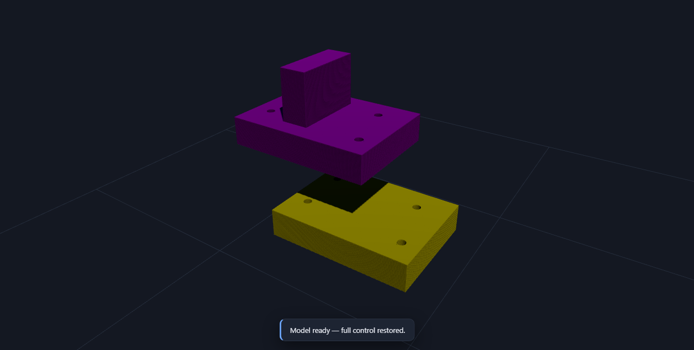
:::

::: callout
**Turn a CAD file into a live, shared 3D scene.** CAD Viewer is a real-time
collaborative browser app for viewing CAD geometry. Anyone on your network can
open the model with nothing more than a web browser — no CAD software, no
licences, no installs. Everyone shares the same view, and everyone can interact
with it.
:::

### At a glance

Instead of emailing files back and forth, share a live model:

| Instead of… | CAD Viewer lets you… |
|---|---|
| Export → email → wait → open → repeat | Share one **join link**; the model appears instantly |
| Sending multi-MB CAD bundles | Convert to lightweight **GLB/GLTF** once and share a small file |
| Explaining with static screenshots | **Point, move, measure and zoom together** on the live model |
| Guests installing CAD software | Guests open the link in **any browser — nothing to install** |
| Worrying about files leaving your PC | The model is **streamed to memory only**; nothing is written to the guest's disk |

### Application features

::: features
**Both host and guest can interact.** This is not a one-way broadcast — anyone
in a session can orbit, zoom and pan, show or hide parts, highlight a part, move
parts along X/Y/Z, measure distances, and chat — all mirrored live in both
directions.

**Live sync.** Camera, part visibility, selection, part moves, measurements,
transparency, the exploded view, and lighting/animation are shared between all
members in real time. Late joiners automatically receive the current model and
view state.

**Measure & inspect.** Click two corners of any part to read an exact distance in
millimetres, and add notes in the session chat.

**No install for guests.** A guest needs only a browser — open a link and the
shared model appears. Nothing to download, nothing to set up, no CAD licence.

**Nothing is stored on the guest.** The model is streamed to the guest's memory
(RAM) only and rendered in the browser; no file is written to their disk. Close
the tab and it's gone — ideal for sensitive geometry or NDA work.

**Efficient sharing.** STEP, IGES and STL files are converted to **GLB/GLTF** —
a lightweight, web-native format — on the server, so one compact file moves fast
across the network instead of a bulky CAD bundle.

**Cross-platform & faithful.** Works in any modern browser on Windows, macOS,
Linux and tablets; part names, colours and materials survive the conversion, so
reviewers see the design the way it was authored.
:::

### What it helps with

::: callout
**Online calibration of engineering design.** Because everyone shares the same
live view and can interact with it, the design-review / calibration loop
collapses from email-and-export cycles into one shared session — questions are
answered immediately, on the actual geometry, by pointing, measuring and looking
together.
:::

### Use cases

::: features
**Design review / sign-off** — review the model together across offices or the
shop floor instead of exchanging exports.

**Remote inspection** — check a part or assembly before manufacturing, from
anywhere on the network.

**Live design changes** — everyone watches the part move as it happens.

**Client demo** — show the design without installing CAD on the client's
machine.

**Vendors & subcontractors** — share the live model with a supplier to align on
geometry, fit and tolerances before fabrication.

**Cross-site calibration** — compare a real part against the shared model live,
from a different location.
:::

---

## 2. Starting the app

**Portable zip (Windows, no installs):**

1. Unzip `cad-viewer-portable.zip` anywhere.
2. Double-click **`start.bat`**. It automatically selects bundled/local native
   OpenCascade/OCP 7.9.3 when available, then opens the browser.
3. The app is served at **http://localhost:8088/**

**From source:** double-click the repository's `start.bat` to auto-detect
`%USERPROFILE%\venvs\cad-native\Scripts\python.exe`, or run `npm start` / `node
src/server.js` manually with `CAD_PYTHON` configured.

### Changing the port

The default port is **8088**. Any of these overrides it:

| Method | Example |
|---|---|
| Launcher argument (zip) | `start.bat 5555` |
| `port.txt` file next to the launcher (`start.bat` / `start.sh`) | create `port.txt` containing `5555` |
| Environment variable | `set PORT=5555` then `npm start` (Windows) / `PORT=5555 npm start` (macOS/Linux) |

Precedence: command-line argument → `port.txt` → env `PORT` → default 8088.
The join link and `/ip` address always reflect the actual port, so guests don't
need to know it.

### Changing the language

The viewer starts in English. To change the interface language, scroll to the
**About** section at the bottom of the left sidebar and use the **Language**
selector. Choose **繁體中文** or **简体中文**; the choice is remembered in the
browser. English is always available as the fallback for missing or invalid
individual translations.

Chinese language add-ons are external UTF-8 JSON files. In a source checkout,
set `CAD_LANGUAGE_DIR` to the folder containing `zh-Hant.json` and
`zh-Hans.json`; portable builds place reviewed files under `languages/` next to
`server.js`. See `doc/TRANSLATION-WORKFLOW.md` for validation and packaging.

> **STEP, IGES and STL files** (.step/.stp, .igs/.iges, .stl) use the local
> OpenCascade/OCP 7.9.3 runtime when configured, and fall back to Docker if it
> is unavailable. GLB/GLTF files work without either CAD backend.

### Installing the local STEP converter (OpenCascade/OCP 7.9.3)

To open **STEP / IGES / STL** files without Docker, install a native Windows
Python environment containing `cadquery-ocp` 7.9.3.1.1. The server only needs
the executable path; guests never need the CAD runtime.

`start.bat` detects the conventional `%USERPROFILE%\venvs\cad-native` location
automatically. To use another environment, set the path before starting:

```bat
set CAD_PYTHON=C:\Users\you\venvs\cad-native\Scripts\python.exe
set CAD_BACKEND=auto
node src\server.js
```

Use `CAD_BACKEND=native` to require the native runtime, or `CAD_BACKEND=docker`
to force the existing Docker backend. In `auto` mode, the server preflights
`import OCP`, prefers native conversion, and falls back to Docker when the
selected Python cannot import OCP.

The Model panel shows the active backend after the server health check.

### Docker fallback setup

If native OCP is not installed, the viewer can still use the existing Docker
fallback. This is a **one-time** setup on the PC that runs the server — guests
never need it.

Run **`install-docker-opencascade.bat`** (double-click it; it sits in the same
folder as `start.bat`). It walks through everything:

| Step | What the script does |
|---|---|
| **1. Docker check** | If Docker Desktop isn't installed, it installs it automatically via `winget` (~500 MB download) and starts it. You can also install it yourself from https://www.docker.com/products/docker-desktop/ and re-run. |
| **2. Wait for engine** | Waits until the Docker engine is running (first start can take a few minutes). |
| **3. Build the image** | Builds the **`chair-cq:local`** OpenCascade image from the bundled `Dockerfile` — first build downloads ~1 GB and can take **5–15 minutes**. |
| **4. Verify** | Runs a quick check that the OpenCascade kernel is ready, so you know STEP conversion will work. |

**To install it manually** (instead of the script):

1. Install **Docker Desktop** and make sure the engine is running.
2. Open a terminal in the distribution folder and build the image:
   ```
   docker build -t chair-cq:local .
   ```

That's it. Once the image exists, STEP / IGES / STL files convert normally. If
you only ever open **GLB / GLTF** files, you can skip this entirely.

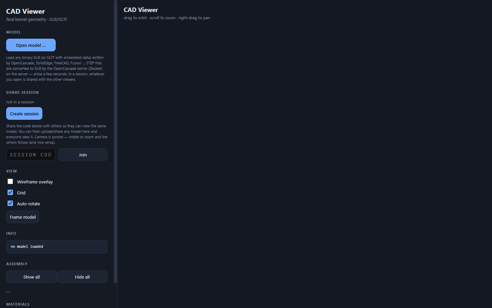

---

## 3. Opening a model

1. Click **Open model…** in the left sidebar.
2. Choose a `.glb`, `.gltf`, `.step`, `.stp`, `.igs`, `.iges` or `.stl` file from your computer.

GLB/GLTF loads instantly. STEP, IGES and STL files are converted to GLB by the
OpenCascade kernel on the server (a blocking overlay shows progress — a few
seconds).


The sidebar shows you:

- **Info** — generator, mesh/triangle counts, dimensions and units
- **Assembly** — the Assembly tree (see §4)
- **Materials** — swatches of every colour in the model

---

## 4. The Assembly panel — parts and visibility

Every part of the model appears in the **Parts** tree, shown in a floating panel
at the **left edge of the viewport**. The tree opens expanded to **level 2** (the
top assembly plus its direct children); deeper levels are collapsed until you
expand them. (The tree used to live in the sidebar; it now lives here so the
sidebar stays uncluttered.)

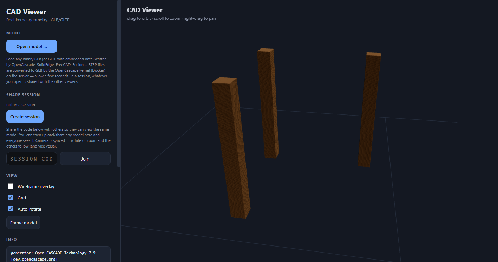

### Expand / collapse

- Rows that contain sub-parts show a **+/− toggle** on the left.
- Click **+** to expand (show children), **–** to collapse (hide them).
- Expanding/collapsing is purely visual — it never changes part visibility.

### Show / hide parts

- **Checkbox** per part: uncheck to hide it in the viewport, check to show.
- Toggling a parent cascades to its whole subtree — turning a sub-assembly on
  brings all its children back with it (three.js needs the whole chain visible
  to render anything).
- **Show all / Hide all** buttons apply to the whole model at once.

### Filter the tree

A **Filter parts…** box at the top of the Assembly tree narrows it to parts whose
name matches what you type (matching ancestors stay visible so you can see where
a part sits). Clear the box to restore the full tree. Filtering is purely local —
it never changes part visibility or the other members' view.

### Highlight a part (click the name, or click it in the viewport)

Click a part's **name** to highlight it in blue in the viewport — or **click the
part directly in the 3D viewport** to select it the same way (left-click on the
part; left-click empty space to clear). Click another part to move the
highlight; click the same part again to clear it. The highlight uses per-mesh
material copies, so other parts sharing the same source material are unaffected.


Clicking a part directly in the 3D viewport highlights it the same way:

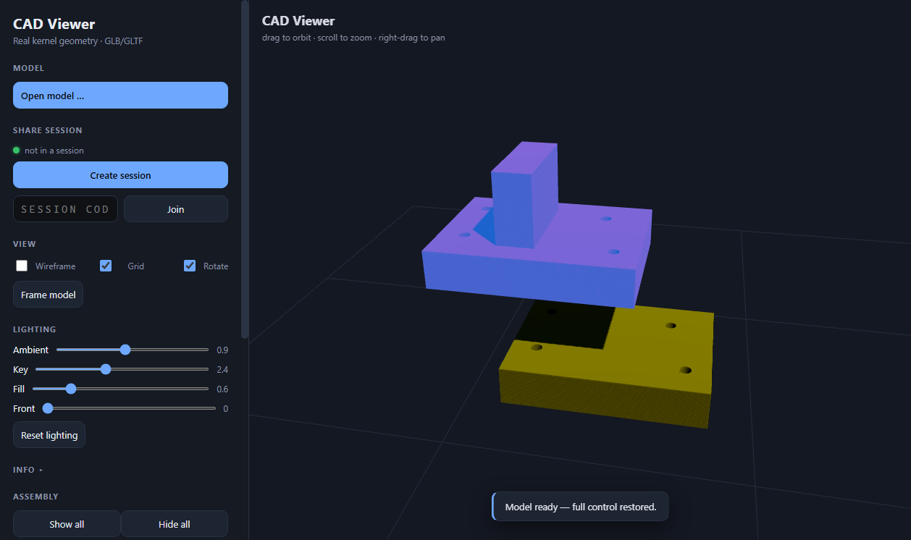

### Part name on hover

Move the mouse over a part in the 3D viewport and a small **tooltip** shows the
part's name at the cursor, while its row in the Assembly tree highlights. This
answers "which part is this?" instantly, without clicking.

While you are orbiting, panning or zooming, the tooltip and tree highlight are
paused so the camera stays responsive; they return on the next mouse move after
you release.

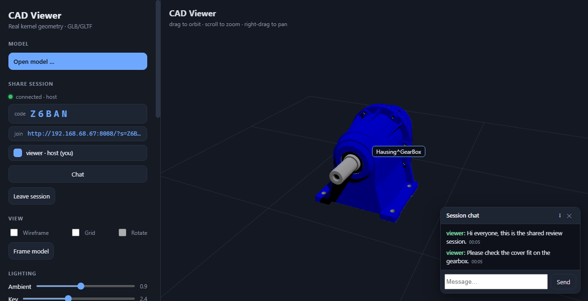

### Right-click menu (Hide / Move / Show me only / Make transparent / Comment)

Right-click a part — either its name in the tree, or the part directly in the
viewport — to open a menu with five actions:

| Action | What it does |
|---|---|
| **Hide part** | Turns that part (and its subtree) off in the viewport |
| **Move part** | Selects the part and arms the axis gizmo so you can move it (see §5) |
| **Show me only** | Hides everything except that part and its children; ancestors stay visible so the isolated part still renders |
| **Make transparent** | Renders the part at 16% opacity so you can see through it (see §8); the item reads **Make opaque** when the part is already transparent |
| **Comment…** | Opens a small text box; type a note and press **Send** — it posts `[Part name] your note` into the session chat for everyone (see §15). A session is required. |


---

## 5. Moving and rotating parts

A selected part can be moved along the X, Y or Z axis, or rotated around an axis
using the compact interaction toolbar and the viewport gizmo. The same toolbar
also provides direct access to Pivot and Measure modes.

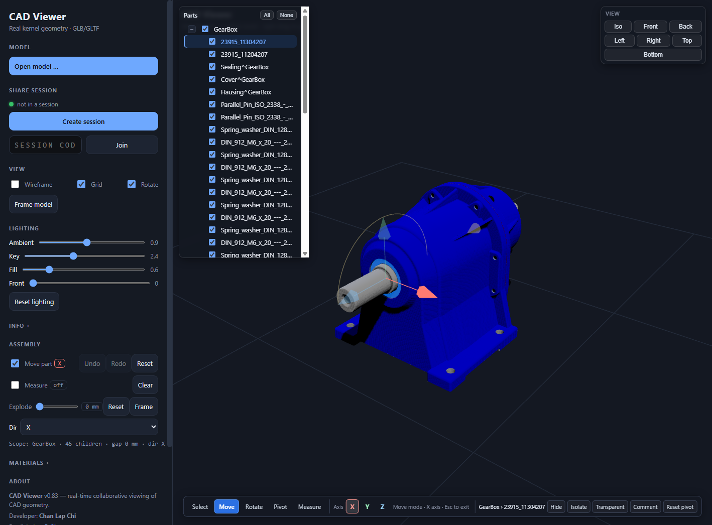

### Start a move

1. **Select the part** — click its name in the Assembly tree, or click it directly
   in the 3D viewport.
2. Click **Move** in the compact toolbar below the viewport. The selected part's
   axis gizmo appears, and the contextual actions remain available on the right.
3. Choose an axis by clicking **X**, **Y**, or **Z** in the toolbar, or click the
   matching gizmo arrow. The active axis is highlighted.

You can also right-click a part and choose **Move part**; this opens the same move
mode for users who prefer the contextual menu.

### Drag to move

With an axis chosen, **left-drag** in the viewport to slide the part along that
axis. The selected **part moves by itself** — its siblings stay put. Press **Esc**
to cancel an active move. A completed drag becomes one Undo history step.

### The gizmo

The X/Y/Z arrows (red/green/blue) stay about **1/8 of the screen** at any zoom
level — zoom in and they shrink to keep that size. The armed arrow glows brighter
than the others. The toolbar status text explains the current mode and axis.

### Undo, redo & reset

Transform history covers **moves, rotations, and custom-pivot adjustments**. Each
completed drag is one history step, up to 200 steps.

- **Undo** reverses the most recent transform.
- **Redo** reapplies the most recently undone transform.
- Keyboard shortcuts: **Ctrl+Z** to undo, **Ctrl+Y** or **Ctrl+Shift+Z** to redo.
- Starting a new transform after Undo clears the Redo history.
- **Reset** returns all parts to their original positions, collapses the exploded
  view, and clears both histories.

In a session, Undo and Redo broadcast the resulting complete transform to the
other members. If another user changed the same part in the meantime, the stale
Undo or Redo is refused instead of overwriting the newer change — and the message
names who changed it (e.g. *"Cannot undo: Bob changed this part"*). If a peer
moves or rotates a part you currently have selected, you'll also get a live
notice naming them.

### Rotate a part

Besides sliding, a part can be **rotated** around an axis using the same gizmo:

1. **Select the part** and arm the gizmo (right-click → **Move part**, or tick
   **Move part** in the sidebar).
2. **Pick an axis** — click the X / Y / Z gizmo arrow (or press **X / Y / Z**). A
   **semi-circle arc with an arrow** appears in the plane perpendicular to that
   axis.
3. **Press R** (or click the arc's arrowhead) to arm rotate — the arc glows.
4. **Left-drag** around the arc to spin the part about that axis.

Rotations share the same **Undo / Reset** as moves and sync to every member of a
session.


**In a session, part moves and rotations sync to every member** — move or rotate
a part and the others watch it live, and can move/rotate it back.

### Custom pivot

Use the **Pivot** tool in the compact toolbar above the viewport to move the
rotation centre away from the part's own centre:

1. Select a part.
2. Choose **Pivot** and drag the crosshair to the desired rotation centre.
3. Choose **Rotate**, arm an axis, and drag the rotation arc.
4. Use **Reset pivot** in the selected-part toolbar to return to the default
   centre.

The pivot is included in transform history and is synchronized atomically with
the part position and rotation. Each part remembers its own pivot while the
model is loaded, so switching selection restores that part's pivot. **Reset
pivot** clears only the selected part; the global **Reset** clears every saved
pivot, and reloading the model starts a fresh pivot map.

### Compact interaction toolbar

The toolbar above the viewport provides direct access to **Select**, **Move**,
**Rotate**, **Pivot**, and **Measure**. It also shows the active axis, the next
required action, transform completion/cancellation feedback, and contextual
selected-part actions. Press **Esc** to cancel the active interaction.

---

## 6. Measuring distances

The **Measure** tool reports the exact distance between two corners of a part in
millimetres — handy for checking a dimension during review.

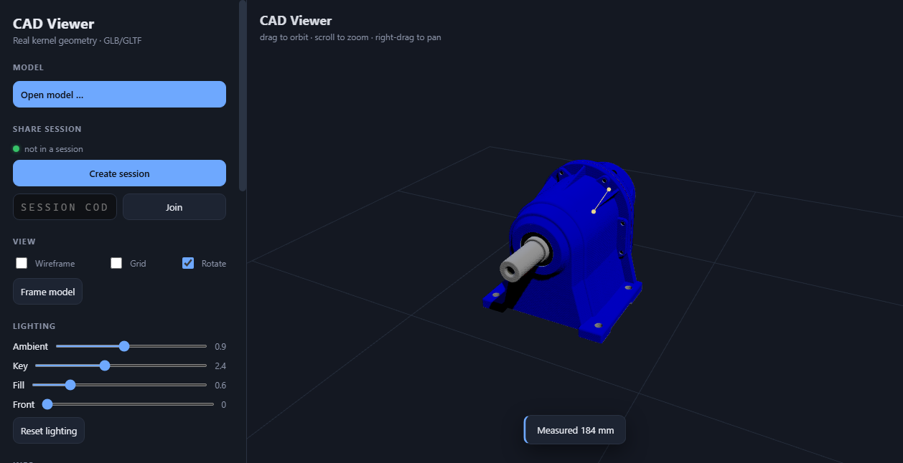

### How to measure

1. Tick the **Measure** checkbox in the Assembly panel (it turns **Move part**
   off — the two are mutually exclusive).
2. Move the mouse over a part. As you get near a **corner**, a small amber glow
   snaps to it and a live readout appears.
3. **Click the first corner**, then **click the second corner**. An amber
   dimension line is drawn between them and added to the measurements list.

### The measurements list

Each measurement is shown in the list with:

- the **distance** (mm) and its elevation angle,
- the **P1** and **P2** corner positions (mm),
- its azimuth angle.

Use the **✕** next to an entry to delete it, or **Clear** to remove all. **Esc**
cancels the in-progress first point.

> **Corners only.** The tool snaps to the part's corners (sharp edges), so it
> gives meaningful points rather than random spots on a face.

**In a session, committed measurements sync to every member** — and late joiners
see the measurements that were already made.

### Dimension annotations

Each committed measurement also draws a **CAD-style dimension** in the viewport,
on top of the amber line:

- a crisp **dimension line** with **arrowheads** at both ends, and
- a **distance label** (in the current mm/in unit) sitting beside the line at its
  midpoint, with a dark outline so it stays readable over the model.

The annotation always faces the camera and re-projects live as you orbit, zoom or
pan, so it stays glued to the two measured corners.

---

## 7. Exploded view

The **Explode** slider spreads the assembly's parts outward so you can see how
it is put together — each part slides away from the assembly centre along its
own direction.

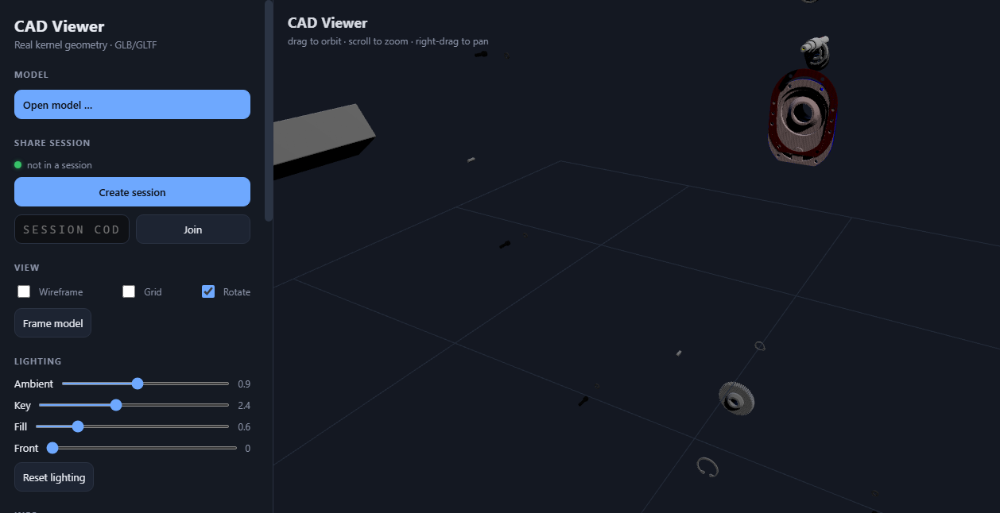

### Controls

- **Explode** slider — drag from **0 mm** (assembled) upward to separate the
  selected assembly's immediate children.
- **Dir** — choose an explicit **X / Y / Z** world axis. Parts on the + side move
  +, on the − side move −.
- **Scope** — select an assembly in the Parts tree to explode its immediate
  children. With nothing selected, the viewer uses the default top-level
  assembly. Selecting a leaf part leaves the last valid assembly scope active.
- The scope readout shows the assembly name, child count, gap, and direction.

The explosion is **non-destructive**: pressing **Explode Reset** returns every
part exactly to its resting position. Use **Frame** separately when you want to
reframe the whole model.

**In a session, the explode state syncs to every member** — whoever moves the
slider, everyone follows.

---

## 8. Part transparency

Make a part **transparent** so you can see through it to the geometry behind —
great for inspecting a housing, cover, or how parts nest.

1. **Right-click** a part (its name in the tree, or the part in the viewport).
2. Choose **Make transparent**. The part renders at 16% opacity.
3. To restore it, right-click again and choose **Make opaque** (the menu item
   reflects the current state).

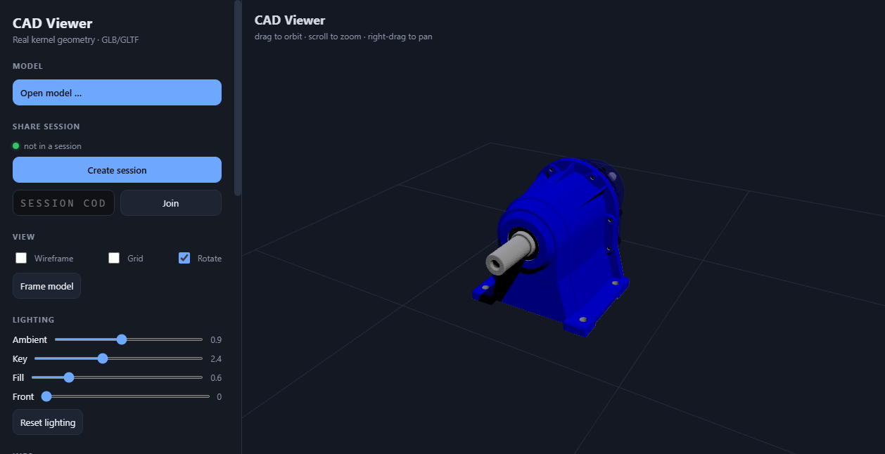

Transparency composes cleanly with selection — you can select, move, and
measure a transparent part without it snapping back to opaque. **In a session,
transparency syncs to every member.**

---

## 9. Navigating the viewport

| Action | Effect |
|---|---|
| **Drag** (left button) | Orbit the camera |
| **Scroll** | Zoom |
| **Right-drag** | Pan |
| **Frame model** button | Reset the view to fit the model |
| **Wireframe overlay** | Toggle wireframe on all parts |
| **Grid** | Toggle the ground grid |
| **Auto-rotate** | Slow turntable spin (disabled in a session) |

### Preset views

A small **View** panel sits in the **top-right corner** of the viewport with
standard camera orientations:

| Button | View |
|---|---|
| **Iso** | Isometric (the default angled view) |
| **Front / Back** | Looking along the model's Z axis |
| **Left / Right** | Looking along the model's X axis |
| **Top / Bottom** | Looking straight down / up (with a corrected up-vector) |

Each frames the model from that direction. In a session the camera follows these
presets too.

The **📷** button in the same panel downloads the current view as a **PNG image**
(`cad-view-<timestamp>.png`) — handy for pasting into chat, notes, or a review
record. It captures exactly what you see and is local (nothing is sent to the
session).

---

## 10. Section view (cut plane)

The **Section** tool in the sidebar (under *MODEL CONTROL*) clips the model along
a flat plane so you can inspect internal geometry — housings, channels, and how
parts sit inside an assembly.

| Control | What it does |
|---|---|
| **Section** checkbox | Turns the cut on / off |
| **Axis** | Which way the cut plane faces (**X**, **Y** or **Z**) |
| **Offset** | Slides the cut plane along that axis (shown in the current unit) |
| **Reverse** | Keeps the opposite side of the cut |
| **Reset** | Turns the cut off and restores the full model |

### Cut-plane overlay

While Section is on, the viewport shows two helpers so you can see exactly where
the model is cut:

- A **semi-transparent blue plane** positioned at the cut, sized to the model,
  and drawn over the geometry so it is always visible.
- **Orange contour lines** tracing where the plane cuts through the surfaces of
  the visible parts — the cross-section silhouette.

Drag the **Offset** slider and both the plane and the contours follow live, so
you can sweep through the model to find a section of interest. The overlay is
purely visual — the geometry is clipped only by the section plane itself.

### Saved cuts (presets)

To revisit the same cut later, **name the current section** in the "Name this
cut…" box and press **Save cut** (or Enter). It appears as a chip under the
section controls — click it to jump straight back to that axis/offset, or **✕**
to remove it. The active cut is highlighted. Presets are shared in a session, so
every member sees and can jump to the same named cuts, and they clear when a new
model is loaded.

### Export a cut as a 2D drawing

Two buttons under the section controls, **Export SVG** and **Export PNG**, save
the current cross-section as a flat 2D drawing of the **contour silhouette**
(the same orange lines shown in the viewport), projected onto the cut plane and
sized in the current unit (mm or in):

- **SVG** — crisp, scalable vector, ideal for printing or dimensioning in a CAD
  or drawing tool.
- **PNG** — the same drawing rasterized, easy to paste into notes or chat.

Each file carries a small label such as `Section Y · 60 mm`. Export is local to
your viewer and never sent to the session.

---

## 11. Model corrections (units, scale, flip, rotate)

A small **Model** panel floats at the **bottom-left** of the viewport (collapsed
by default — click the **Model ▸** header to expand it). It lets you correct how
a model is presented on the fly, without re-exporting from CAD:

| Control | What it does |
|---|---|
| **Units** | Switches distance readouts between **mm** and **in** — affects measurement distances, point coordinates and the section offset |
| **Scale** | A **0.1×–10×** multiplier on top of the automatic scale, to fix a mis-scaled model (**Reset** restores 1×) |
| **Flip** | Mirrors the model along **X**, **Y** or **Z** to correct a wrong orientation |
| **Rotate** | Pick an axis and an angle (degrees), then **Rotate** to spin the whole model around that axis |
| **Reset corrections** | Clears the scale, flips and rotation in one click |

**In a session the corrections are shared with every member** — change units,
scale, flip or rotate on one viewer and the others update live, and a late joiner
receives the current corrections too.

---

## 12. Lighting & animation

### Lighting

A **Lighting** section in the sidebar lets you tune the light on the model:

| Control | What it does | Range | Default |
|---|---|---|---|
| **Ambient** | Even fill from the sky and ground | 0–2 | 0.9 |
| **Key** | Main directional light (casts shadows) | 0–6 | 2.4 |
| **Fill** | Cool fill light from the opposite side | 0–3 | 0.6 |
| **Front** | Light straight from the viewer's side — handy when the front face is too dark | 0–3 | 0 (off) |

Drag a slider and the model updates live. **Reset lighting** restores the defaults.

### Animation

If the GLB you load contains **keyframe animation** (e.g. from Blender or a game pipeline — CAD-converted STEP/IGES/STL files have none), an **Animation** section appears with:

| Control | What it does |
|---|---|
| **Play / Pause** | Start or stop the clip |
| **Loop** | Repeat the clip (off = play once and stop) |
| **Speed** | Playback speed 0.25×–4× |
| **Clip** | Pick a clip when the model has several |

### Session sync

In a session, the **lighting levels (Ambient/Key/Fill/Front)** and the **animation state (clip, play/pause, loop, speed)** are shared with the other viewers, and late joiners receive the current settings. Camera, part visibility, tree expand/collapse, selection, part moves, measurements, transparency and the exploded view sync as well (see §14).

---

## 13. Collaborative sessions (host)

Sessions let other people on your LAN view the same model and follow your
camera and part visibility.

> On launch you're asked to **enter your name**; it is shown to the other
> viewers in the roster (e.g. `Alice · host`, `Bob (you)`). Your name is
> remembered for next time.

1. Click **Create session** — a 5-character code appears.
2. **Open a model** (or re-share one you've already loaded).
3. Share the **join link** shown under the code, or the code itself, with the
   other users.

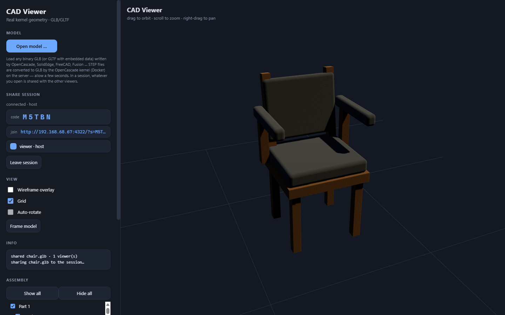

While the model is being handed to guests you'll see a blocking
**“Sending model to guest(s)…”** overlay; control is restored automatically once
every connected guest confirms receipt.


The roster under the code shows who is connected. The **host** can remove a
viewer by clicking **kick** next to their name; the removed viewer's screen is
cleared and they see *"removed by host"*. A small status dot next to "Share
session" shows whether the server is reachable (green = up, red = down).

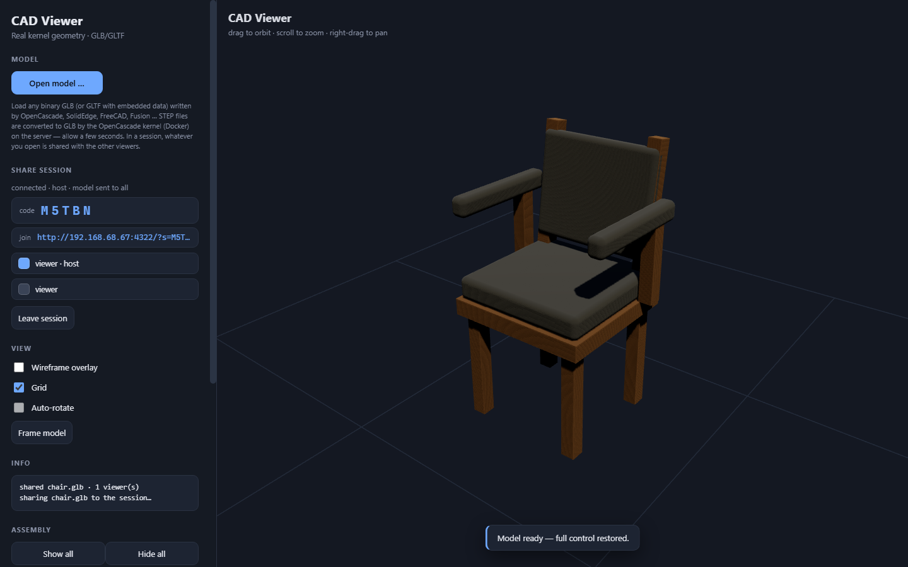

The **chat window opens automatically** when you create or join a session (see
§15) — just start typing.

---

## 14. Joining a session (guest)

On another computer (same network):

1. Open the **join link** the host sent you, **or**
2. Open the app, type the code into **session code** and click **Join**.

You'll see a **“Receiving model…”** overlay with byte progress, then the model
appears — same view, same parts, same visibility as the host.

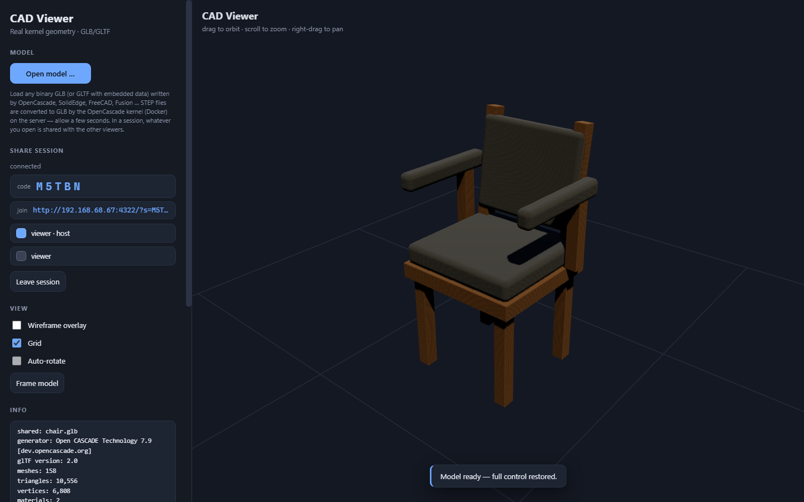

### What stays in sync

- **Camera** — whoever orbits/zooms/pans, everyone follows (both directions)
- **Part visibility** — show/hide any part and it changes for all members
- **Part moves** — moving a part updates it for everyone
- **Measurements** — a dimension you add appears for everyone
- **Transparency & explode** — part transparency and the exploded view match
- **The model itself** — late joiners automatically receive the current model
  and visibility state
- **Expand/collapse & selection** — the assembly-tree view and part highlight
  are mirrored live across members

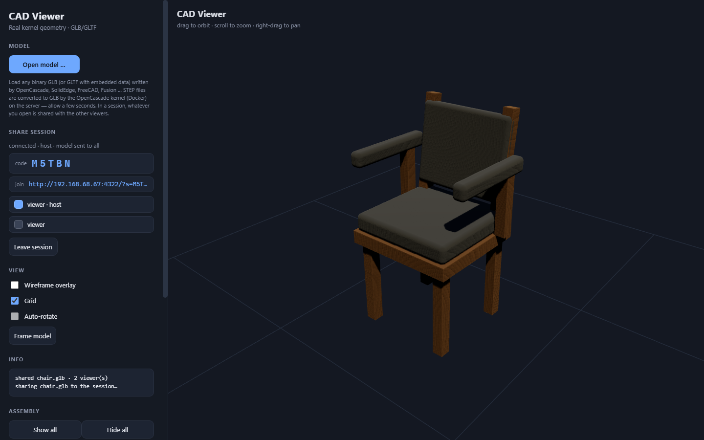


> **Security — nothing is stored on the guest.** The model is **streamed to the
> guest's memory only** and rendered in the browser. **No file is written to
> the guest's disk**; closing the tab discards it.

---

## 15. Session chat

Every session has a built-in **chat window** so members can talk while they
review. It opens automatically when you create or join a session.

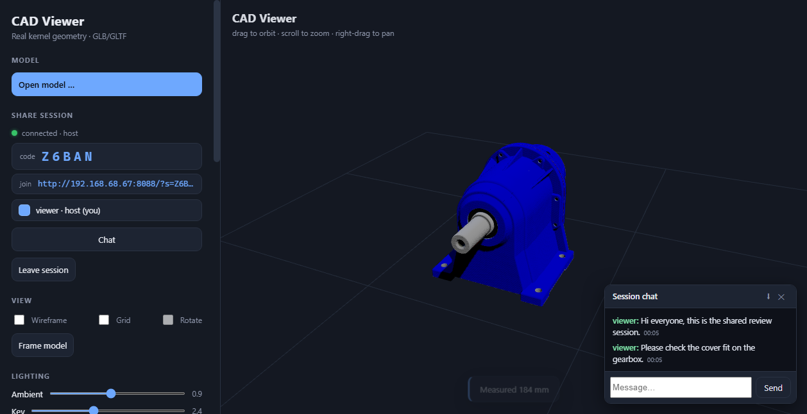

### Chatting

- Type in the message box at the bottom and press **Enter** (or click **Send**).
- Each message shows the **sender's name**, the **text**, and the **time**; your
  own messages are highlighted in green.
- Close the window with **✕** and reopen it with the **Chat** button in the
  session panel.

### Chat history

- Messages are kept on the server (up to 200) and **replayed to late joiners**,
  so a new member sees the whole conversation, not just what's said after they
  join.
- Click the **⬇** button in the chat header to **download the transcript** as a
  `.txt` file (`chat-<session-code>-<date>.txt`). Each line is
  `HH:MM  name: message`, with a header recording when it was generated.

---

## 16. Leaving a session

Click **Leave session** to leave. What happens depends on your role:

- **Guest** — the shared model is **cleared from your view** when you leave on
  your own (for security, nothing stays on your screen), and you return to the
  empty viewer. The session stays alive for the other members.
- **Host** — you keep your local model and return to solo viewing, but the
  session **ends for everyone else**: the shared model belongs to the host, so
  when the host leaves (or closes the browser), every guest's shared model is
  **cleared** and they see *"host left — session ended"*. There is no new host —
  a hostless session is dead.

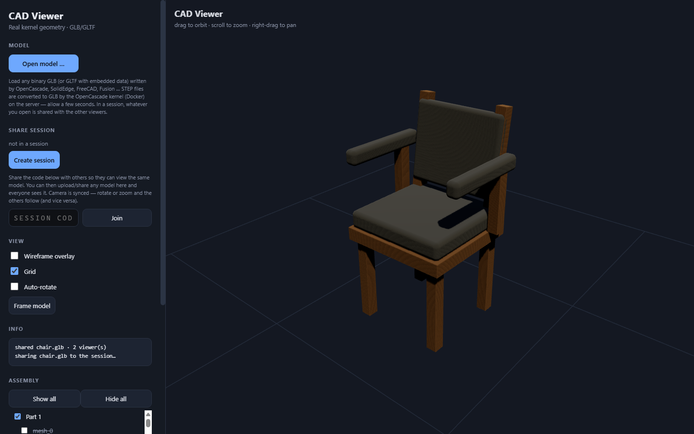

---

## 17. Opening a STEP / IGES / STL file

STEP, IGES and STL conversion happens through the OpenCascade kernel. Local
OCP 7.9.3 is preferred when configured; otherwise Docker is used automatically.
The first time you open one you'll see the conversion overlay; when it finishes
the GLB is loaded — with the original **colours and materials** preserved, and
part names appearing in the Assembly tree.

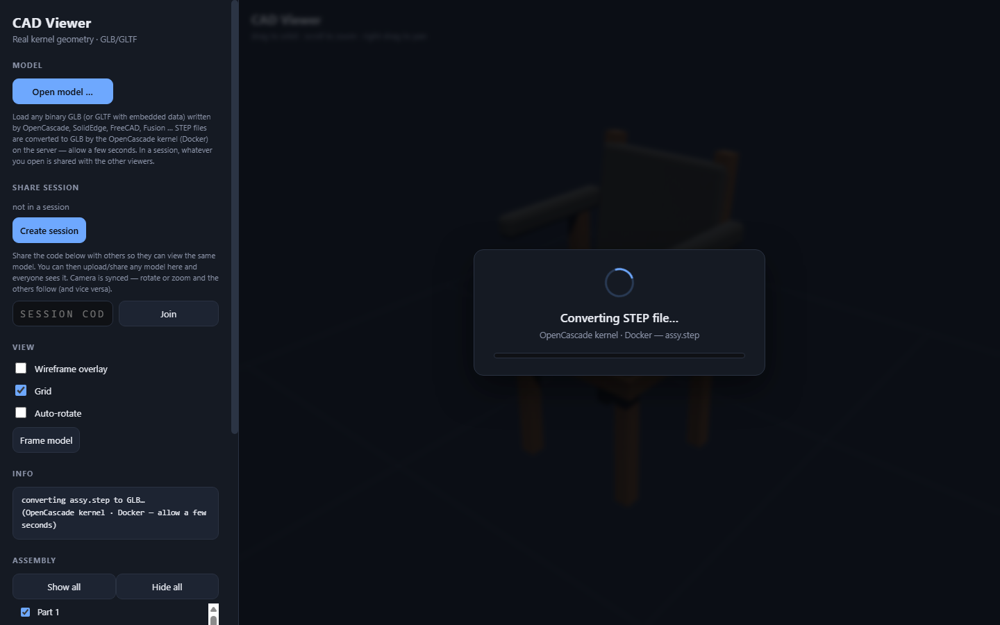

If neither local OCP nor the `chair-cq:local` image is available, these formats
show a conversion error while GLB/GLTF continues to work normally.

---

## 18. Offline CAD converters

Besides the viewer, the separate **CAD Converter** project provides a standalone
`convert-cad` tool (v0.26) that turns STEP / IGES / STL files into GLB / GLTF
**without** the viewer. It is independent of the viewer's own converters, so
using it can never disturb them.

If you want to optimize a model **offline before opening or sharing it in CAD
Viewer**, there are two CAD Converter editions:

| Edition | Type | Best for |
|---|---|---|
| **CAD Converter** (`convert-cad`) | Web-enabled tool | Drag-and-drop conversion, preview, and optional Draco compression in a browser |
| **CAD Converter2** | Desktop tool | Offline conversion and optimization from a native desktop application |

Use either edition to prepare a lightweight GLB/GLTF first. The converted file
can then be opened in CAD Viewer without running a CAD conversion during the
viewing session. For large models, the web-enabled CAD Converter offers a
**Draco** option; compare the resulting file size because Draco is most helpful
for dense geometry and is not smaller for every multi-part CAD assembly.

### What it converts

| Input | Notes |
|---|---|
| `.step`, `.stp` | B-rep; keeps assembly part names + per-part colours |
| `.igs`, `.iges` | B-rep; keeps colours; parts named `Part1..N` |
| `.stl` | Mesh; converted host-side by the pure-JS writer (no Docker) |

Output format is chosen by the **output file extension**: `.glb` → a single
binary file; `.gltf` → text JSON + a companion `.bin`.

### Using the drag-&-drop web UI (recommended)

1. Launch the web UI from the standalone CAD Converter project: double-click
   **`convert-cad-web.bat`** (Windows), or run `node convert-cad-server.mjs`.
2. Open **http://localhost:8787/** in a browser.
3. **Drag & drop** a CAD file onto the page (a STEP/IGES/STL file).
4. Pick **.glb** or **.gltf**, click **Convert**.
5. **Preview** the result in the built-in 3D viewer (drag = rotate, scroll =
   zoom, right-drag = pan), then **Download**.

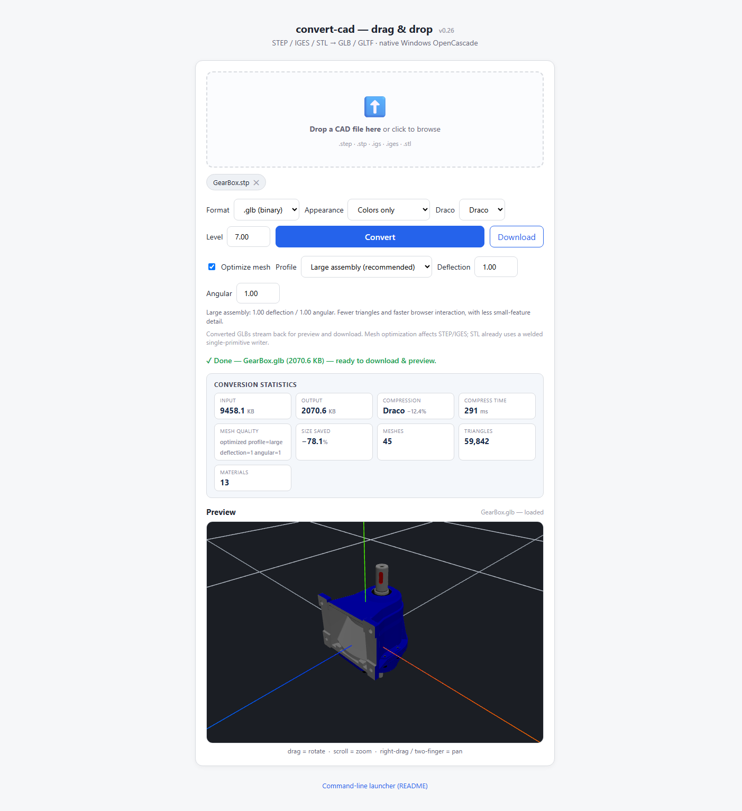

### Using CAD Converter2 (desktop tool)

CAD Converter2 is the desktop edition for offline conversion and optimization.
Launch its current portable desktop executable, select a STEP / IGES / STL file,
choose the output format and optimization/compression settings, then click
**Convert**. The desktop tool reports conversion statistics such as part count,
face reduction, output size, processing time, and shows the assembly tree beside
the 3D preview.

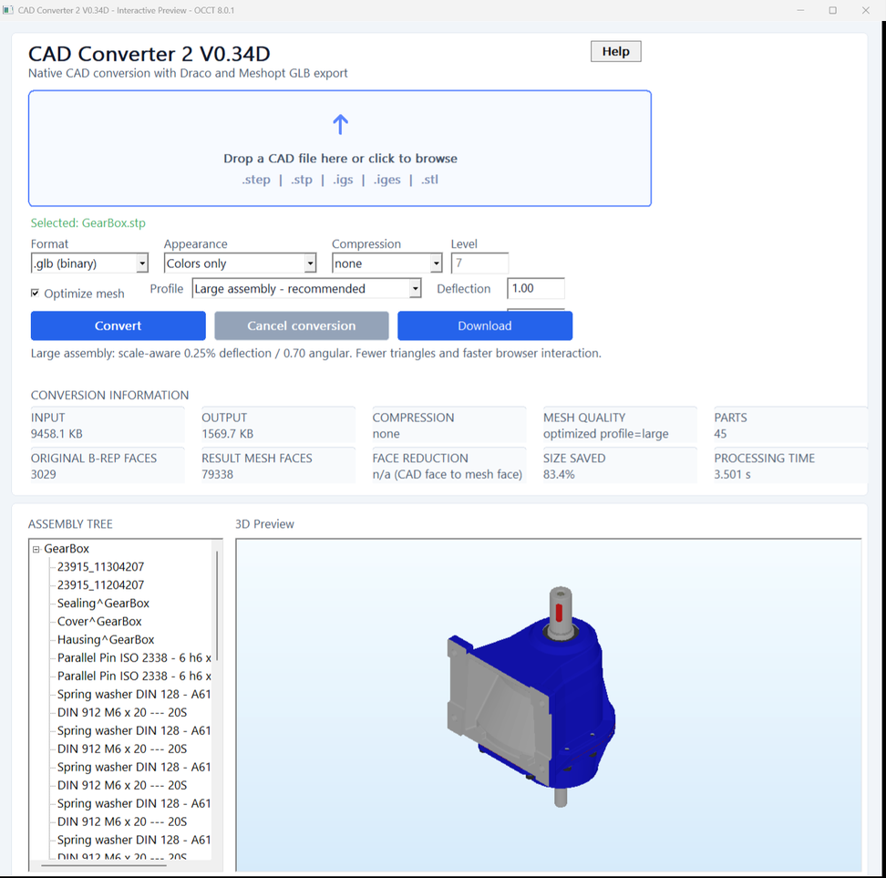

### Using the command line

```bash
node convert-cad.mjs input.step output.glb      # run from the CAD Converter project
```

### Requirements

The standalone converter uses native OpenCascade/OCP 7.9.3. The viewer's
conversion backend is independent: set `CAD_PYTHON` for local OCP, or use the
viewer Docker fallback (`install-docker-opencascade.bat`, or `docker build -t
chair-cq:local .`). **Node.js** is needed for the launcher.

### How it helps sharing

Convert a CAD file to GLB/GLTF once, then hand the lightweight file to someone
who opens it directly in the viewer — they never need Docker or the converter.
It's the same "one compact file over the network" idea, applied offline.

---

## 19. Troubleshooting

| Problem | Fix |
|---|---|
| Can't open the app on another PC | Use the **join link** (LAN address), make sure both PCs are on the same network, and that port 8088 isn't blocked by a firewall |
| STEP/IGES/STL shows “conversion failed” | Check the Model panel backend; set `CAD_PYTHON` to a Python where `import OCP` succeeds, or run `install-docker-opencascade.bat` and confirm `chair-cq:local` |
| Guest doesn't get the model | The host must be connected with a model loaded — joining an empty session shows nothing until the host shares |
| Port already in use | Change it: `start.bat 4323` (zip), a `port.txt` file, or `set PORT=4323` |
| Join link shows the wrong IP | The link uses the host's LAN address; refresh/re-create the session to re-detect it |
| Measure tool won't snap | Make sure the **Measure** checkbox is on, and click near a part's **corner** (the tool snaps to corners, not faces) |
| Explode looks like the whole model moves | Set **Level** to **All parts** — a single top-level sub-assembly (e.g. one wrapper node) moves as one unit |

---

## 20. Sharing with external parties

By default the viewer is meant for the **local network (LAN)**. To let someone
outside your network view a session, you have two main options.

### Option 1 — Port forwarding on the router

1. Find the server PC's **LAN IP** (e.g. `192.168.x.x`).
2. In your router's admin page, set up a **port forward**: forward the app's
   port (default **8088**) to that LAN IP and port.
3. Share **`http://<your-public-IP>:8088`** with the external party.

> **Notes.** The public IP can change (use a dynamic-DNS service if needed).
> Opening a port exposes the server to the internet — use this only for trusted
> people, keep it temporary, and close the forward when you're done. For real
> deployments, prefer HTTPS (e.g. a reverse proxy like Caddy/Nginx with TLS).

### Option 2 — Deploy on a public / virtual server

1. Provision a small **virtual server** (VPS/cloud instance) with a public IP
   or domain.
2. Copy the distribution and run the server there (`node src/server.js`), or
   package it into the same Docker image.
3. Share the server's URL with the external party.

This is the best option for **always-on** external access (client demos,
vendors/subcontractors joining anytime) because it doesn't depend on a home
router or a machine that must stay on.

> **Security reminder.** Whatever route you use, anyone who has the link can
> view the shared model. The viewer streams the model to the guest's memory and
> writes nothing to disk, but for sensitive or NDA geometry, still share links
> only with people who are meant to see the model, and consider a private
> network / VPN (e.g. Tailscale, WireGuard) for the most controlled access.

---

*CAD Viewer v1.00 — collaborative CAD viewing for the LAN. · [Changelog](CHANGELOG.md)*
